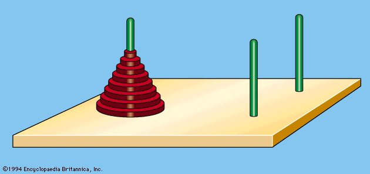

# The Tower of Hanoi

In the great temple at Benares, beneath the dome which marks the center
of the world, rests a **brass plate** in which are fixed **three diamond needles**,
each a cubit high and as thick as the body of a bee. On one of these
needles, at the creation, God placed **sixty-four discs** of pure gold, the
largest disk resting on the brass plate, and the others getting smaller and
smaller up to the top one. This is the Tower of Bramah. Day and night
unceasingly the priests transfer the discs from one diamond needle to
another according to the fixed and immutable laws of Bramah, which
require that the priest on duty must not move more than one disc at a time
and that he must place this disc on a needle so that there is no smaller disc
below it. When the sixty-four discs shall have been transferred from the
needle on which at the creation God placed them to one of the other
needles, tower, temple, and Brahmins alike will crumble into dust, and with
a thuderclap the world will vanish.  

